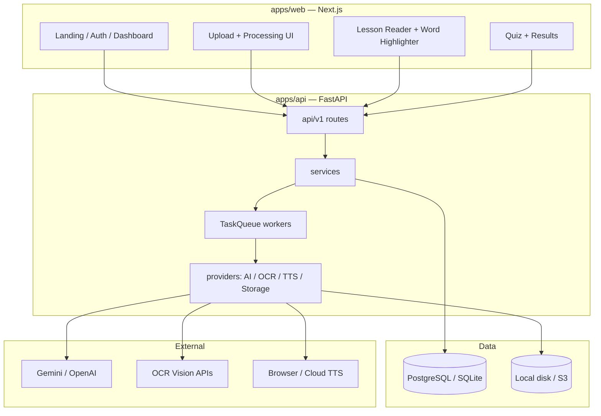
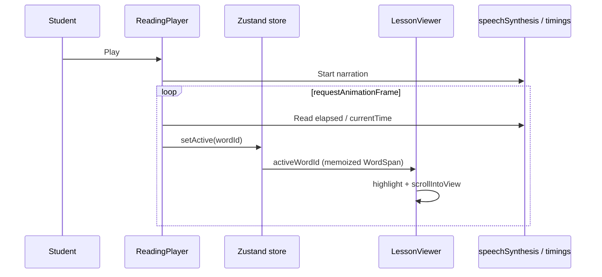

# Architecture Diagram

```mermaid
flowchart TB
  subgraph Client["apps/web — Next.js"]
    UI[Landing / Auth / Dashboard]
    Upload[Upload + Processing UI]
    Reader[Lesson Reader + Word Highlighter]
    QuizUI[Quiz + Results]
  end

  subgraph API["apps/api — FastAPI"]
    Routes[api/v1 routes]
    Services[services]
    Queue[TaskQueue workers]
    Providers[providers: AI / OCR / TTS / Storage]
  end

  subgraph Data
    PG[(PostgreSQL / SQLite)]
    Files[(Local disk / S3)]
  end

  subgraph External
    Gemini[Gemini / OpenAI]
    Vision[OCR Vision APIs]
    Speech[Browser / Cloud TTS]
  end

  UI --> Routes
  Upload --> Routes
  Reader --> Routes
  QuizUI --> Routes
  Routes --> Services
  Services --> Queue
  Queue --> Providers
  Services --> PG
  Providers --> Files
  Providers --> Gemini
  Providers --> Vision
  Providers --> Speech
```

## Word highlighting sequence

```mermaid
sequenceDiagram
  participant S as Student
  participant R as ReadingPlayer
  participant Z as Zustand store
  participant V as LessonViewer
  participant T as speechSynthesis / timings

  S->>R: Play
  R->>T: Start narration
  loop requestAnimationFrame
    R->>T: Read elapsed / currentTime
    R->>Z: setActive(wordId)
    Z->>V: activeWordId (memoized WordSpan)
    V->>V: highlight + scrollIntoView
  end
```
